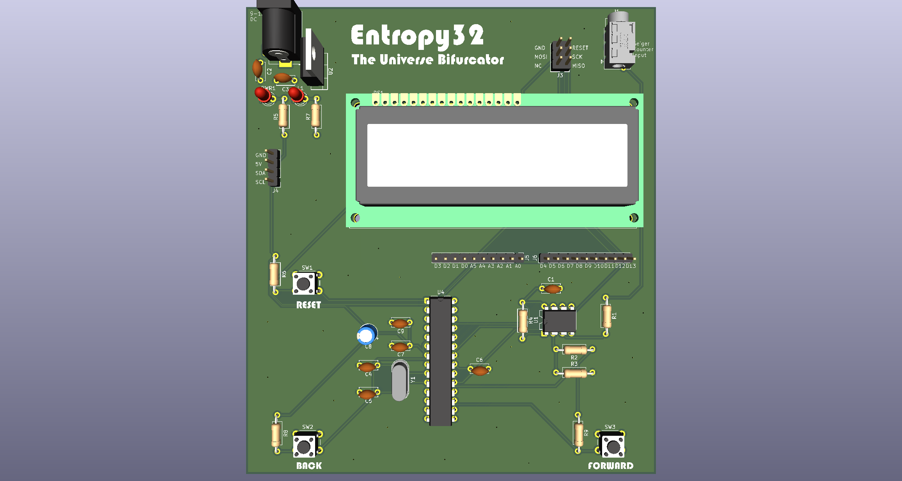
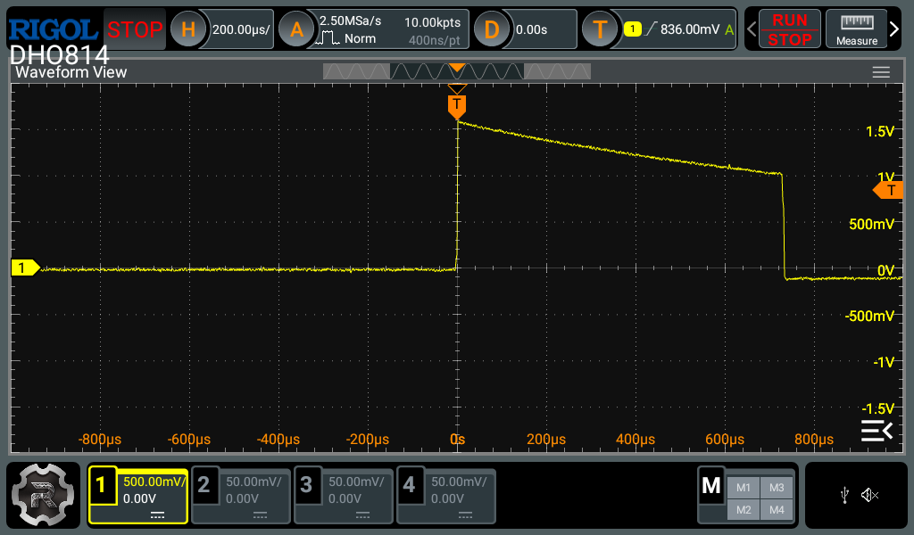
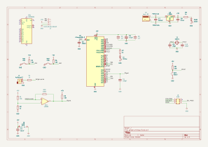

# Entropy32

**Entropy32** (aka *The Universe Bifurcator*) is a dedicated Bitcoin seed phrase generator that uses radioactive decay as its entropy source. It's completely open source and designed to be simple, auditable, and buildable by anyone with readily available components.

## Why radioactive decay?

Pseudo-random number generators are deterministic — given the same seed, they always produce the same output. True randomness for something as consequential as a Bitcoin wallet's seed phrase should come from a physical process nobody can predict or manipulate. Radioactive decay is quantum-mechanically random: the timing of individual decay events is fundamentally unpredictable, making it an ideal entropy source for generating cryptographic secrets.

## How it works

1. A Geiger counter detects decay events from a radioactive source (or background) and outputs a pulse via a 3.5mm audio jack.

2. An LM393 comparator IC then takes the 0-1.5V pulse and compares it to a bias of ~0.5V via a voltage divider such that if V>0.5V we get HIGH else LOW.

3. The timing between events is captured and fed through SHA-256 conditioning to whiten the raw entropy and remove any bias.
4. The conditioned entropy is mapped to words from the standard BIP39 English wordlist.
5. A simple button-driven, state-machine UI walks you through generating and displaying your seed phrase — entirely offline, with no wireless connectivity, no persistent storage of the seed, and no software dependencies beyond the device itself.

## Hardware

- Custom PCB built around an ATmega328P microcontroller, designed in KiCad
- Geiger counter module as the entropy source
- Push-button interface for on-device operation

## Repository contents

| File | Purpose |
|---|---|
| `entropy32.ino` | Main firmware — state machine, entropy capture, and UI logic |
| `sha256.h` / `sha256.cpp` | SHA-256 implementation used to condition raw entropy |
| `bip39_wordlist.h` | BIP39 English wordlist, compiled into firmware |
| `button.h` | Button input handling |
| `english.txt` | Source BIP39 wordlist |
| `generate_wordlist.py` | Script to regenerate `bip39_wordlist.h` from `english.txt` |

## Building it yourself

The Arduino sketch (`entropy32.ino`) and its accompanying `.h`/`.cpp` files must remain in the same top-level folder for the Arduino IDE to compile correctly — it doesn't recurse into subfolders for sketch code. Open `entropy32.ino` in the Arduino IDE, verify your board settings for the ATmega328P, and flash as normal.

## Validation

Entropy quality is being validated against the [NIST SP 800-90B](https://csrc.nist.gov/publications/detail/sp/800-90b/final) methodology for entropy sources used in random bit generation.

## Disclaimer

This is a hobbyist/educational project. If you use it to generate a real Bitcoin seed phrase, understand the risks: verify the entropy quality yourself, review the code, and never trust a seed-generating device (this one included) with significant funds without independent auditing.

## License

See [`LICENSE`](./LICENSE).